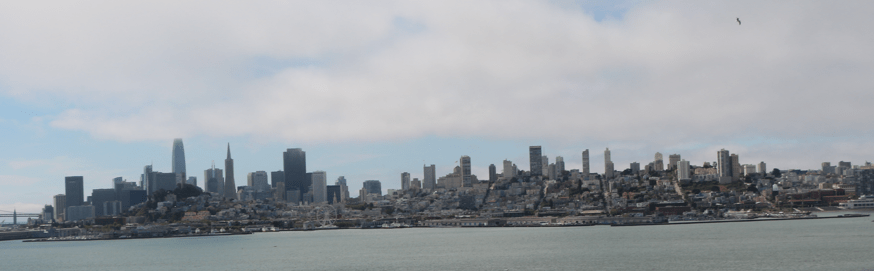
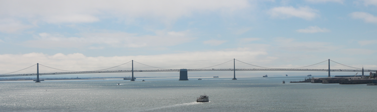
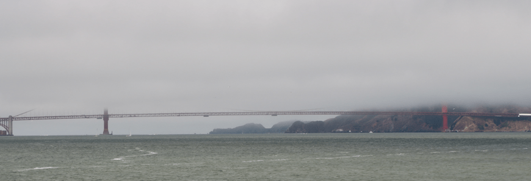
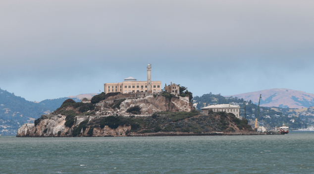
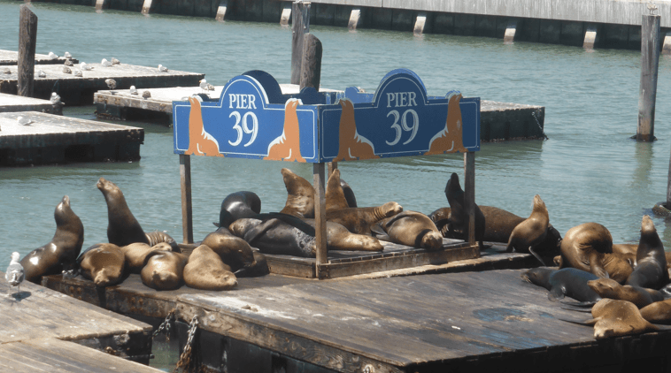
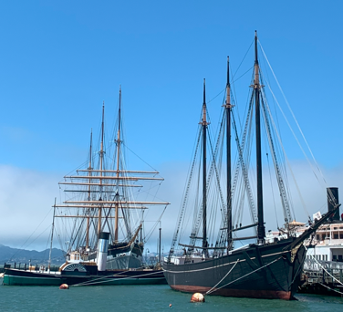
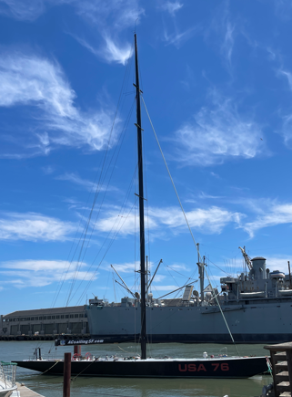

+++
title = "1. August"
date = "2024-08-01"
draft = true
pinned = false
tags = ["SanFrancisco"]
image = "screenshot-2024-08-02-052454.png"
description = "Alcatraz, Temple Hill"
+++
Heute gingen wir am Morgen früh ins Gefängnis. Also wir gingen eigentlich ein Gefängnis anschauen, nämlich das berühmte Hochsicherheitsgefängnis Alcatraz. Es war sehr eindrücklich die kleinen Zelle zu sehnen. Die Gebäude sahen sehr furchteinflössend aus, denn viele Gebäude sahen aus, als würden sie bald einstürzen. Zurück auf dem Festland gingen Mittagessen in der Pier 39. Da sahen wir auch die berühmte Seelöwen, welche seit 1990 dort leben. Danach wollte Annelis unbedingt noch auf den Temple Hill. Wir fuhren dorthin und durften einen Turm hochlaufen (Fahrstuhl war kaputt). Die Aussicht war sehr schön. Annelis wollte auch noch unbedingt in einen Stoffladen. Also gingen wir noch in einen Stoffladen. Wir fanden schönen Stoff, um Hosen zu nähen und noch großartigen Weihnachtsstoff. Wir fuhren wieder an die Fischermans Wharf und assen ein gemütliches und leckeres Abendessen.

