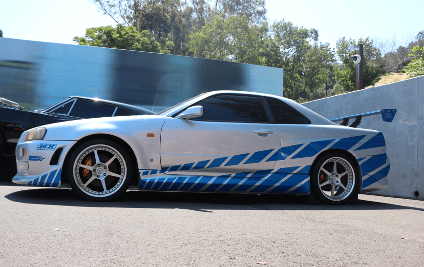

+++
title = "10. Juli"
date = "2024-07-10"
draft = true
pinned = false
tags = ["LosAngeles"]
image = "screenshot-2024-07-11-060700.png"
description = "Universal Studio"
+++
Heute standen die Universal Studios auf dem Programm. 

Am Morgen gingen wir mit den ersten hinein und machten uns sofort auf den Weg zum Harry Potter. Als wir auf der Kartesahen das es Sachen zu Harr<Potter hat, waren wir überrascht den Harry Potter ist keine Universal Produktion. 

Wir gelangten nach Hogsmeade, welches komplett verschneit dargestellt ist.  

Ausserdem war Hogwarts nachgebaut worden. 

Dazu gab es 2 Achterbahnen, die eine war eine etwas langsamere klassische Achterbahn und die andere war eine neumodische Achterbahn, welche sehr schnell und ruckartig sich bewegte.

Danach ging es auf die Studio Tour. Dort fuhr man mit einem Bus durch die ehemaligen Kulissen. Man durfte noch Fotos mit einem nachgebauten Hollywood-Schild machen und Bilder von den Autos aus Fast&Furious. Das gefiel Nick natürlich. 

Danach gingen wir zur Jurassic World und Transformers. Die Bahn vor Jurassic World war eine Wasserbahn, welches sehr angenehm war, denn es war sehr warm. Die Transformers-Bahn war nicht so gut.

Nach dem Mittagessen gingen wir eine Show von WaterWorld schauen. Bei der Show wurde man ebenfalls ein bisschen nass, was sehr willkommen war. 

Danach gingen wir noch auf verschiedene Bahnen und zu verschiedenen Attraktionen. Annelis fand noch den DeLorean aus "Back to the Future".

Danach ging es auch schon in Richtung Anaheim und morgen geht es dann ins Disneyland. 

