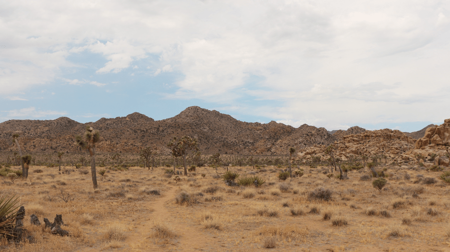
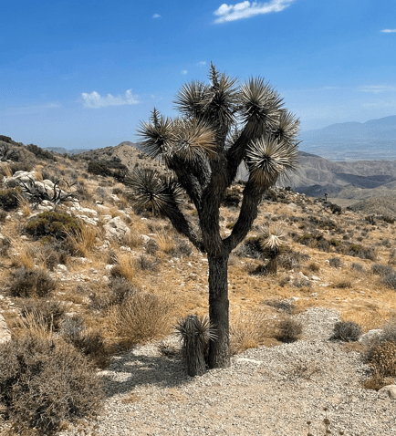
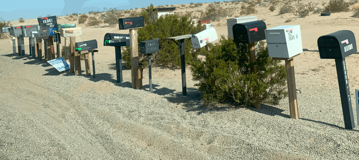

+++
title = "13. Juli"
date = "2024-07-13"
draft = false
pinned = false
tags = ["JoshuaTree"]
image = "screenshot-2024-07-14-051018.png"
description = "Joshua Tree und Needles "
+++
Heute war unser erste Tag im Camper. Nach dem Frühstück ging es los in Richtung Joshua Tree. 

Angekommen fuhren wir ein bisschen durch den National Park. 

Wir gingen noch etwas wandern, doch es war nicht so spannend, denn für eine Nationalpark der Tree (Baum) im Namen hat, hat der Joshua Tree sehr wenig Bäume. 

Am Abend hätten wir eigentlich dort übernachtet, doch das hätte bedeutet, dass wir morgen 6 Stunden fahren müssten. Wir haben daher unsern Plan geändert und sind noch bis Needles gefahren. Somit müssen wir morgen viel weniger fahren. 

In Neddles angekommen, assen wir drinnen (draussen war 46°!) und schauten den Sonnenuntergang. 

