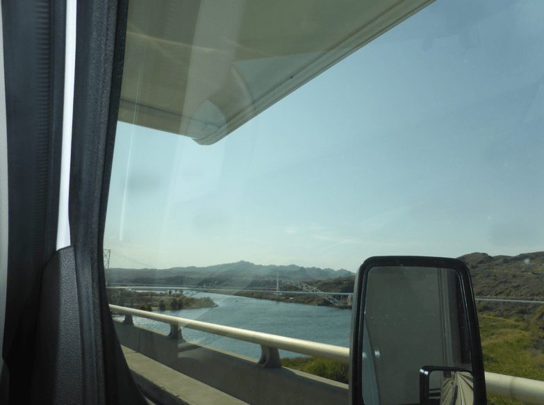

+++
title = "14. Juli"
date = "2024-07-14"
draft = true
pinned = false
tags = ["GrandCanyon"]
image = "screenshot-2024-07-15-011125.png"
description = "Grand Canyon"
+++
Heute machten wir uns sofort auf den Weg ins Grand Canyon. Unterwegs tankten wir noch. Dies war eine sehr spannende Erfahrung, denn man musste zuerst bezahlen, bevor man tankte. Wir mussten entscheiden wie viel wir tankten wollten. Wir wussten allerdings nicht, wie gross unser Tank ist. Also bezahlten wir mal und schauten wie viel das auf der Anzeige ausmacht. Danach hatten wir einen Anhaltspunkt und wir gingen noch einmal bezahlen. Dies reichte immer noch nicht und wir gingen noch ein 3. Mal bezahlen. Dann hatten wir genug Benzin. Wir machten uns auf den Weg und überquerten den Colorado River.

 

Im Grand Canyon angekommen, schauten wir zuerst, was wir heute und morgen machen wollten. Darauf gingen wir zu einem Aussichtspunkt und schauten den Canyon an.

Wir sahen auch noch ein Eichhörnchen.

Danach gingen wir zu unserem Campingpatz und assen zu Mittag. Mitten im Dessert begann es zu regen. Also räumten wir alles nach innen.

Annelis, Adi und Nick gingen noch etwas spazieren. Anna blieb im Camper und las. Am Abend wollten wir grillieren. Adi und Nick machten Feuer. Sie packten Holzkohle in die Feuerstelle und spritzten Anzünder darüber. Nick grillierte dann darauf unser Fleisch.

Nach dem Abendessen bemerkten wir das die Glut immer noch sehr heiss war, doch wir hatten keine Marshmallows. Also gingen Anna und Nick los, um welche zu kaufen. Zurück genossen wir noch unsere Marshmallows.