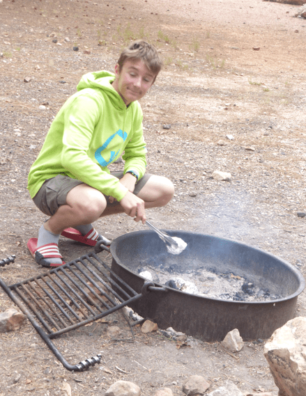

+++
title = "15. Juli"
date = "2024-07-15"
draft = false
pinned = false
tags = ["GrandCanyon"]
image = "screenshot-2024-07-16-044219.png"
description = "Grand Canyon"
+++
Heute Morgen wurden wir mit einer freudigen Nachricht geweckt: Nick hat die Zusage für seine Traumlehrstelle bei Garaventa bekommen. Beim Frühstück bemerkte Nick, dass die Glut vom Feuer von gestern immer noch etwas warm war. Danach machten wir uns auf den Weg zum Grand Canyon, um ein bisschen zu wandern.

Wir starteten beim Visitors Center und gingen los. Nick machte fleissig Bilder.

 Annelis fand die Mauer, auf welchem sie schon von 43 und 30 Jahren sass.

Den Mittag verbrachten wir mit schönster Aussicht und unheimlich zutraulichen Eichhörnchen. Laut Annelis war das vor 30 Jahren noch nicht so. Nach dem Mittag blieb Anna sitzen, genoss die Aussicht, beobachtete die Leute und las. Die Andern ging noch ein bisschen weiter der Kante entlang, so dass sie sogar den Colorado River sahen. Sie kamen mit dem Bus zurück und Adi und Anna gingen mit dem Bus auch noch schnell den Colorado River anschauen. Währenddessen gingen Annelis und Nick zurück zum Camper und genossen es dort.

Sie kochten Abendessen und wir genossen zusammen noch den Abend. Annelis durfte noch Marshmallows bräteln.

Weitere Eindrücke des Tages:

