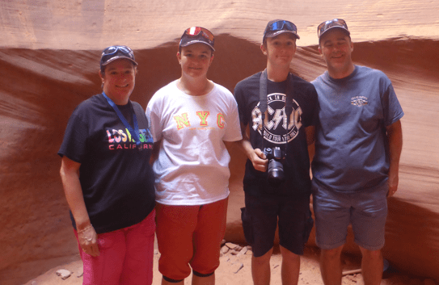

+++
title = "16. Juli"
date = "2024-07-16"
draft = true
pinned = false
tags = ["AntelopeCanyon"]
image = "screenshot-2024-07-17-044100.png"
description = "Grand Canyon, Antelope Canyon, Horesshoe Bend, Glen Canyon Dam"
+++
Heute gingen wir früh los, um den Grand Canyon noch einmal aus einem anderen Winkel anzuschauen. Deshalb gingen wir noch zu Dessert View.

Danach stiegen wir wieder ins Auto und fuhren zum Antelope Canyon. Dort angekommen, waren wir zuerst einmal sehr verwirrt, denn unsere Handys zeigten eine andere Uhrzeit an als die der Einheimischen. Es stellte sich dann heraus, dass je nach dem, woher man den Empfang hatte, man eine andere Uhrzeit hat.

Für die Führung stiegen wir zuerst in einen Van und fuhren näher heran. Danach liefen wir zuerst zur Nordseite des Canyons und dann zu Südseite.

Wir sahen auch noch ein paar Eidechsen.

Danach ging es weiter zum Horseshoe Bend. Auf dem Weg gingen wir noch einkaufen und tanken. Der Horseshoe Bend ist eine Schlaufe des Colorado Rivers.

 Auch hier sahen wir wieder ein Tier:

Danach wollte Annelis noch unbedingt zum Lake Powell. Wir fanden eine Staumauer und gingen diese besichtigen.

Darauf fuhren wir zum Campingplatz und assen gemütlich unser Abendessen.