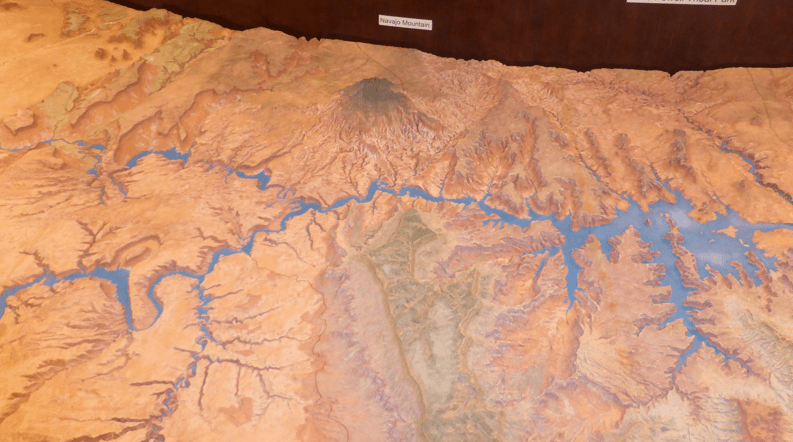

+++
title = "17. Juli"
date = "2024-07-17"
draft = true
pinned = false
tags = ["MonumentValley"]
image = "screenshot-2024-07-18-052327.png"
description = "Page, Lake Powell, Antelope Canyon, Monument Valley "
+++
Heute wollten wir eine Tour auf dem Lake Powell machen. Leider konnten wir dies erst am Nachmittag machen. Am Vormittag gingen wir daher in ein Museum über die Geschichte von Page. Es war sehr interessant und hatte eine anschauliche Reliefkarte von der Gegend.

Zum Mittagessen assen wir endlich richtige Burger.

Danach gingen wir zur Rundfahrt. Es war eine Rundfahrt durch das Antelope Canyon. 1999 war der Wasserstand noch auf der Höhe, wo der rote Teil der Steine beginnt. Heutzutage ist nur noch 40 % des Wassers von 1999 im See.

Nach der Tour gingen wir noch im See baden, denn er war 26° warm.

Danach machten wir uns auf den Weg ins Monument Valley. Es war eine sehr schöne Fahrt. Angekommen genossen wir die schöne Aussicht.

Bilder vom Lake Powell

Bilder vom Monument Valley: 

