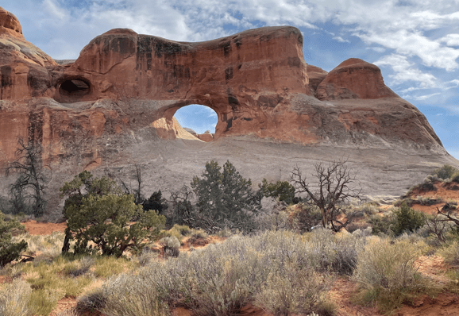

+++
title = "18. Juli"
date = "2024-07-18"
draft = false
pinned = false
tags = ["Arches"]
image = "screenshot-2024-07-19-233757.png"
description = "Monument Valley, Arches "
+++
Heute ging es früh auf, denn wir wollten den Sonnenaufgang anschauen. Es war sehr schön.

Danach machten wir uns auf den Weg nach Moab. Auf dem Weg haben wir ein paarmal angehalten und noch Fotos gemacht.

In Moab angekommen, sind wir in den Arches National Park gegangen und haben ein paar Bögen bestaunt. Wir haben einen der schwierigsten Wege gemacht, denn wir mussten über sehr steile Steine laufen und manchmal mussten wir fast klettern. Zum guten Glück war es etwas bedeckt und es hatte ein bisschen Wind, sonst wäre es viel zu heiss gewesen. Doch es hat sich gelohnt und wir konnten die schönen Natur geniessen.

Am Abend genossen wir Annelises hervorragende Bolognese und die Wärme draussen.

Bilder vom Monument Valley: 

Bildern von Arches: 

