+++
title = "19. Juli"
date = "2024-07-19"
draft = false
pinned = false
tags = ["Arches"]
image = "screenshot-2024-07-23-025350.png"
description = "Arches"
+++
Heute ging es wieder früh los, denn wir wollten den Delicate Arch noch vor der grossen Hitze besuchen.

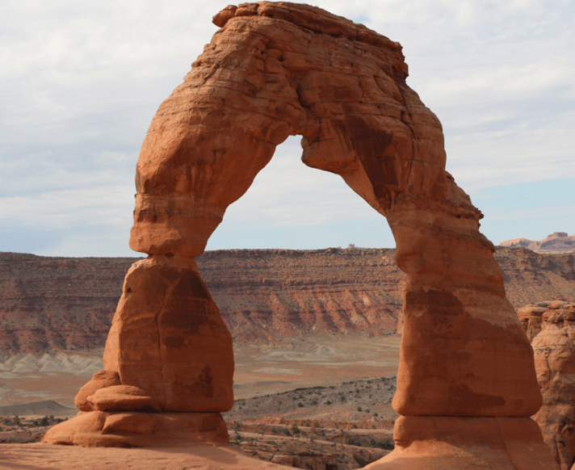

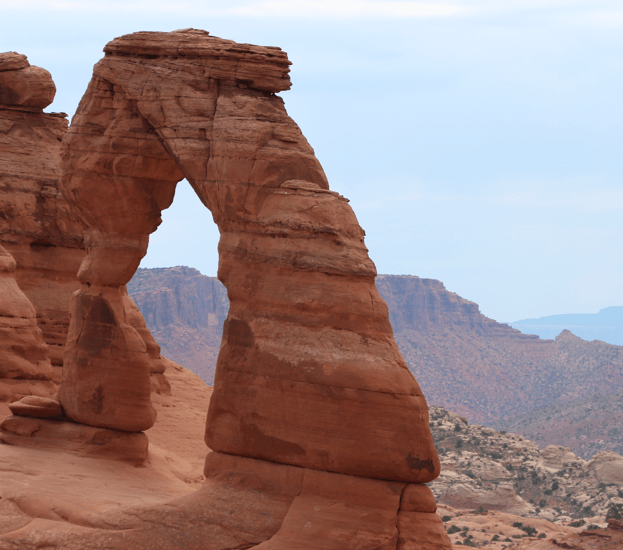

Danach gingen wir weiter und besuchten noch ein paar weitere Arches. Am späten Nachmittag fuhren wir dann auf den Campingplatz und packten unsere Sachen für den Trip nach Yellowstone und räumten etwas auf. Am Abend nach dem Essen hatten wir ein interessantes Gespräch mit einem Amerikaner. Wir sprachen über unsere Reise, das schweizerische und amerikanische Schulsystem, Unterschiede zwischen der USA und der Schweiz und natürlich auch über die Präsidentenwahlen. Das war wohl das Interessanteste, denn er meinte, dass die meisten Amerikaner nicht den wählen, den sie für besser halten, sondern den, der das kleiner Übel ist. 

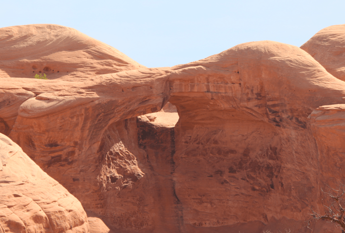

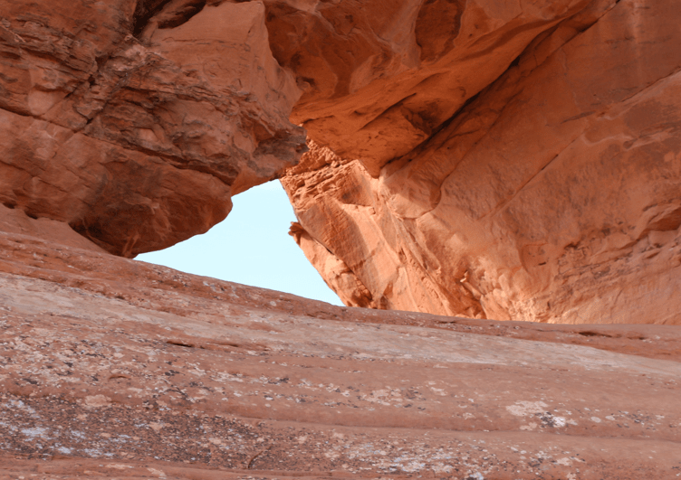

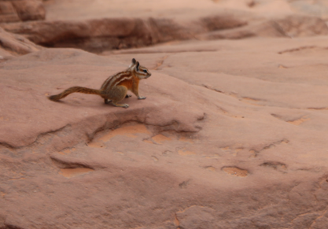

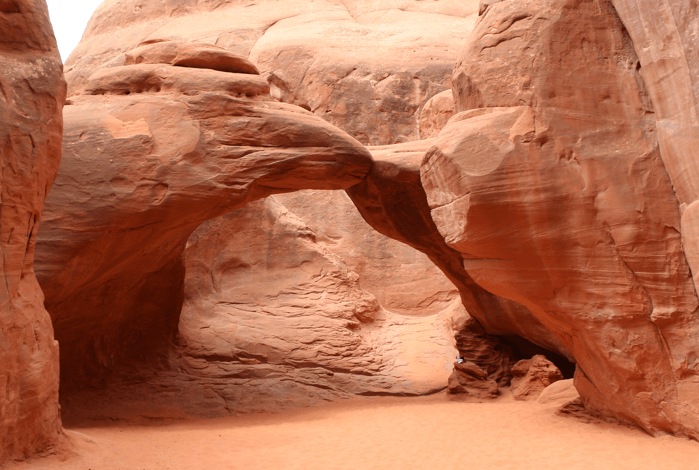

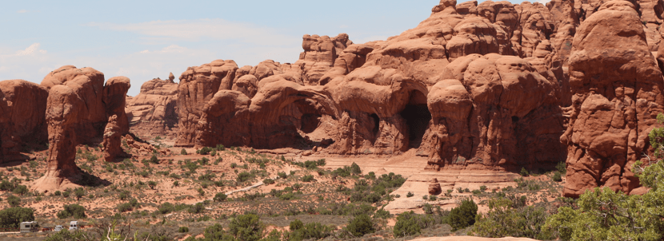

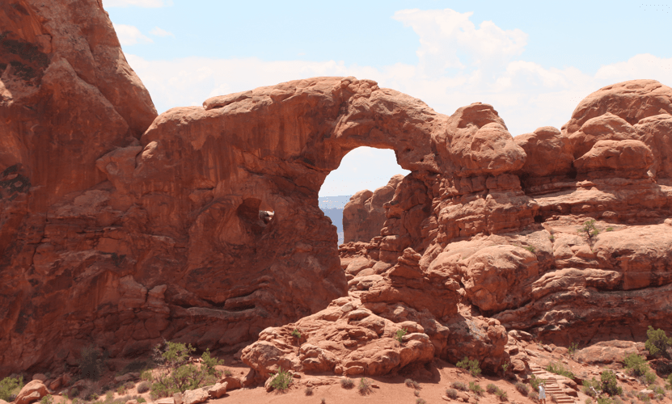

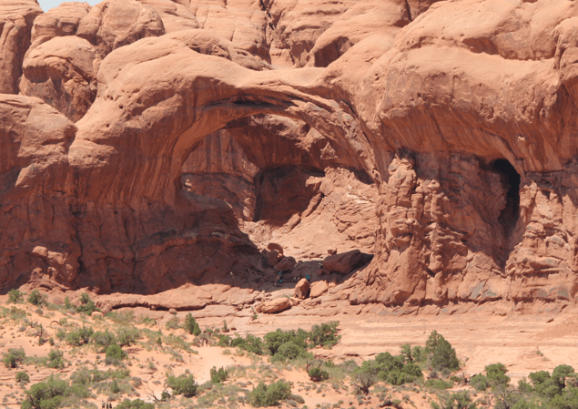

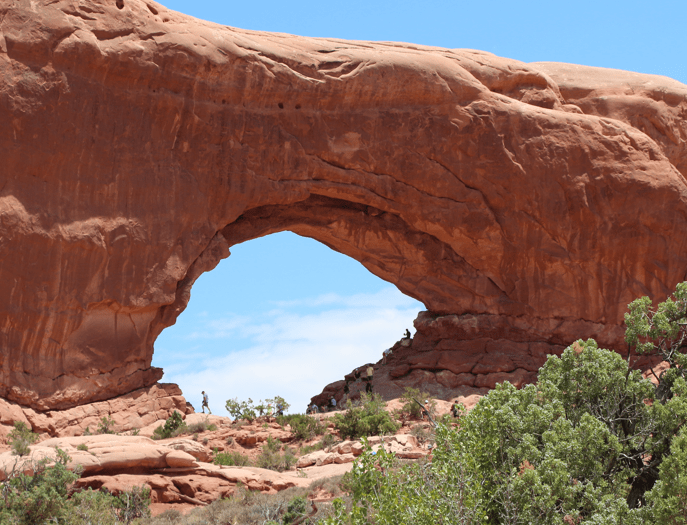

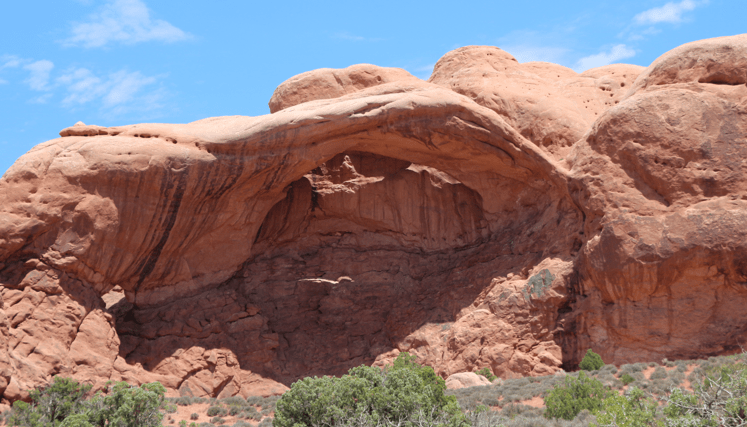

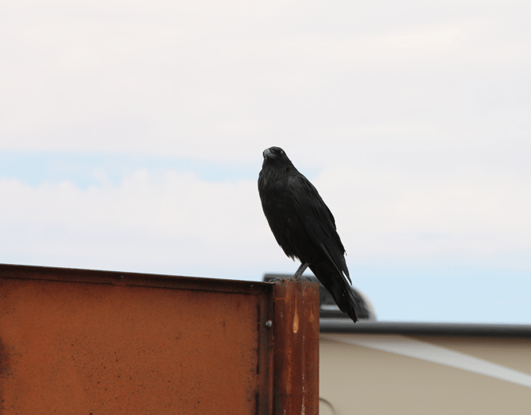

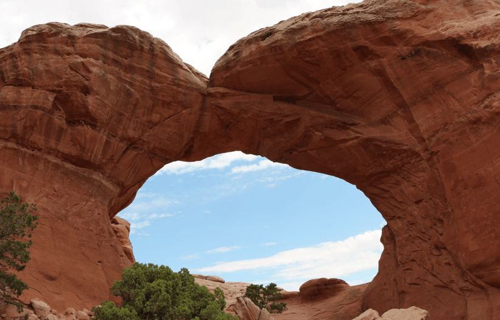