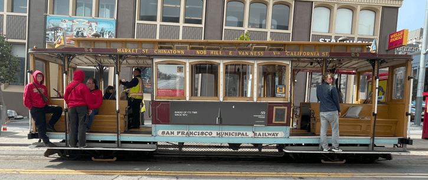
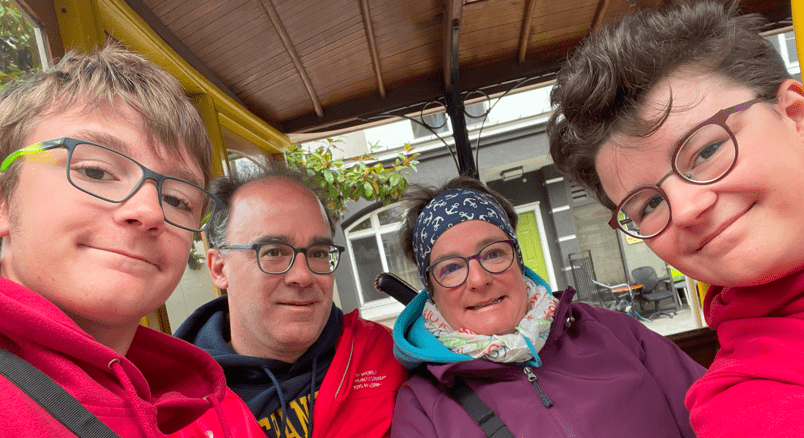
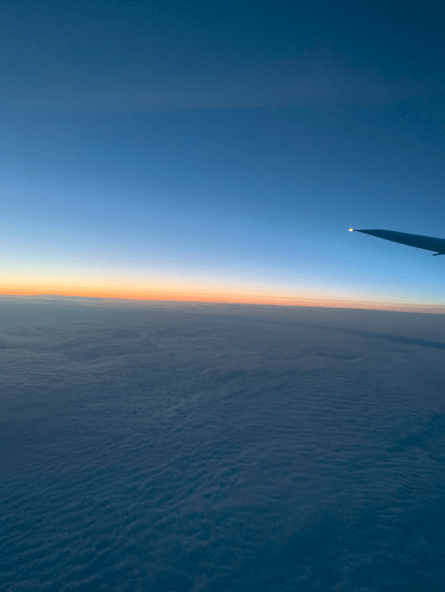

+++
title = "2./3. Juli"
date = "2024-08-03"
draft = false
pinned = false
tags = ["SanFrancisco"]
image = "screenshot-2024-08-03-170132.png"
description = "Cable Car, Heimflug"
+++
Heute gingen wir noch einmal auf den Cable Car und fanden noch eine neue Linie, wo die Wagen anders gestaltet waren. Danach ging es schon in Richtung Flughafen und wir mussten unser Auto abgeben. Die Sicherheitskontrolle ging reibungslos und bald sassen wir im Flugzeug. Wir gingen hoch bis auf 11 000 Meter. Zum Abendessen gab es Teigwaren mit Tomatensosse. Zum Frühstück gab es dann labbrigen „French Toast“. Wir landeten und nahmen den Zug nach Hause.

