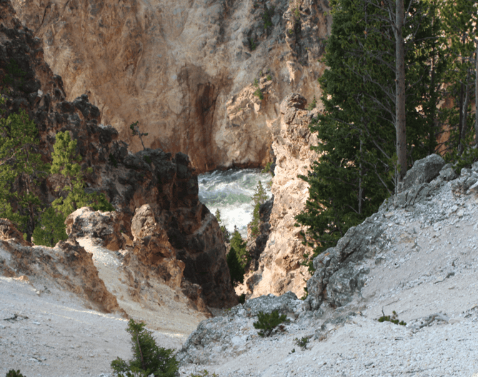
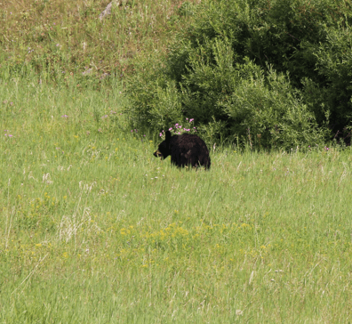
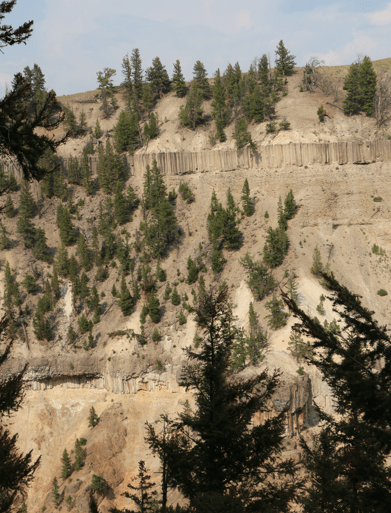
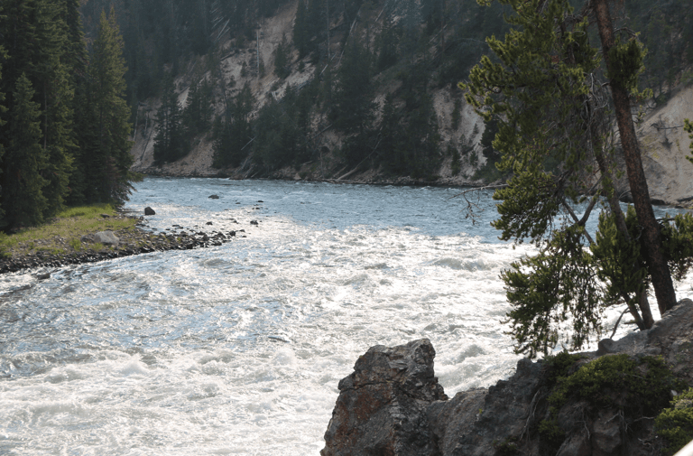

+++
title = "21. Juli"
date = "2024-07-21"
draft = false
pinned = false
tags = ["Yellowstone"]
image = "screenshot-2024-07-23-052224.png"
description = "Yellowstone"
+++
Heute erwachten wir eher früh, um sofort zu den Mammoth Hot Springs zu gehen. Wir suchten ein Frühstück in der Nähe unseres Hotels, doch fanden nichts, also fuhren wir mal los. Bald trafen wir schon auf die ersten Bisons. Später begegneten wir noch einer ganzen Herde. Wir fanden das Grand Canyon vom Yellowstone. Es hatte einen sehr eindrücklichen Wasserfall.

Danach ginge es weiter und wir fanden endlich einen Ort zum Frühstücken. Dann machten wir uns auf den Weg zu den Mammoth Hot Springs. Diese waren sehr eindrücklich, denn man sah sehr gut, wie sie entstehen und sich verändern. Auch dort wurde ein Bild von vor 43 Jahren nachgestellt: Annelis auf dem Zaun von den heissen Quellen.

Danach gab es Mittagessen und wir wollten weiter auf dem Rundweg im Nationalpark, doch die Strasse war gesperrt wegen eines Unfalls. Es hiess, dass die Strasse bald wieder offen ist und deshalb warteten wir. Es lohnte sich, denn sobald die Strasse wieder offen war, gingen wir los und sahen schon bald einen Bär, sogar mit einem Kleinen. Es war sehr süss. Bald darauf sahen wir einen weiteren Bären, welcher nur gerade 2 Meter von der Strasse entfernt genüsslich seine Beeren ass. Wir fuhren weiter auf dem Rundweg und hielten hier und da noch an, um die Landschaft zu schauen oder Tiere zu fotografieren. Wir assen ein Abendessen und fuhren dann nach Hause. Auf dem Nachhauseweg trafen wir noch auf ein paar Rehe mit Kitz. Es war ein sehr ereignisreicher Tag und wir hätten nie gedacht, dass wir so viele Tiere sehen werden.

