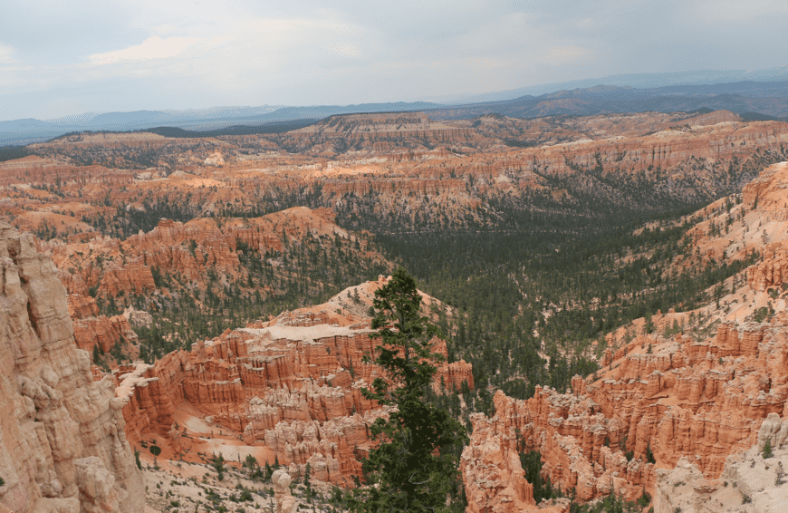
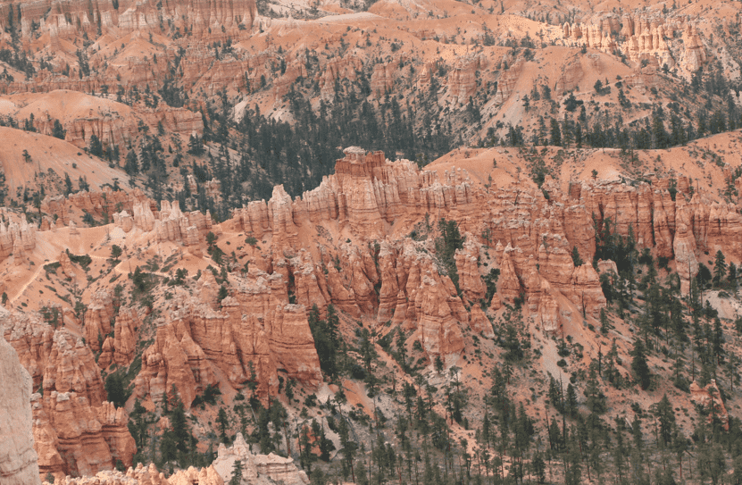
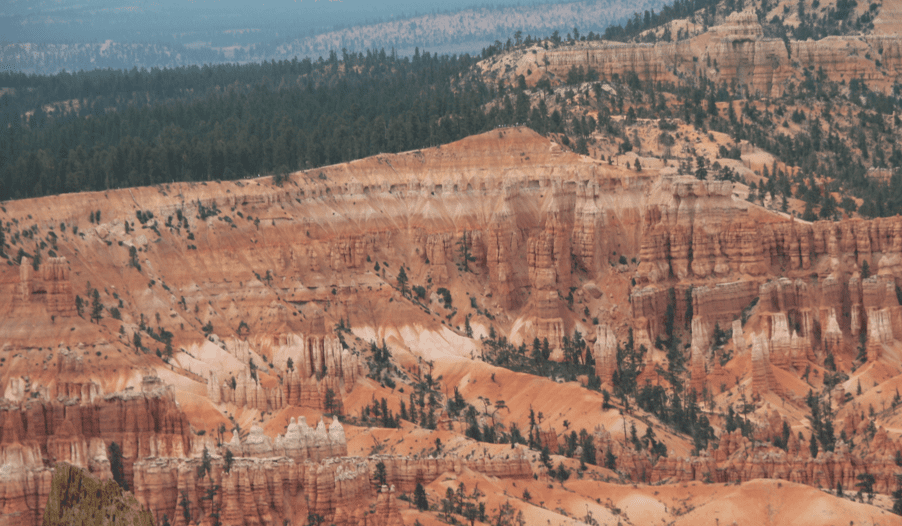
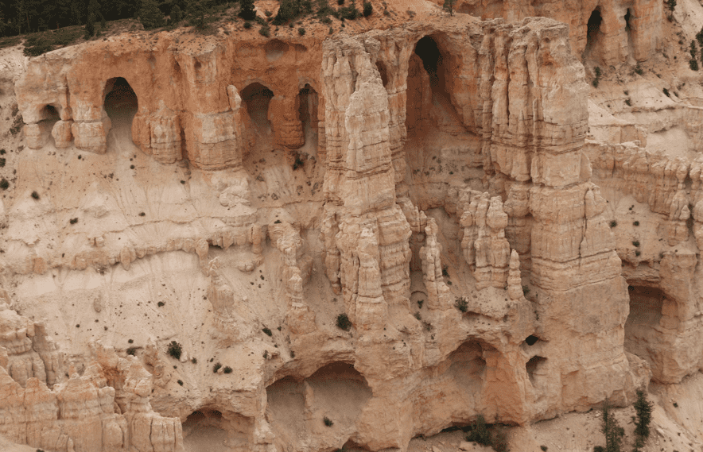
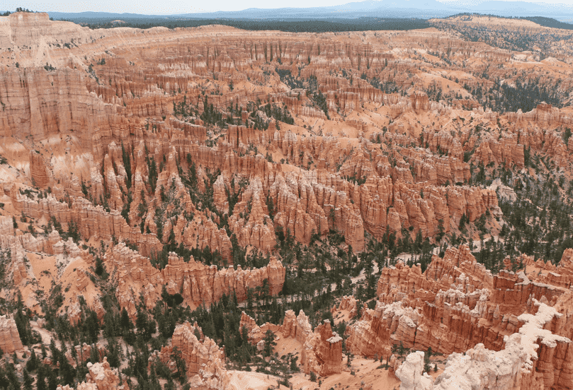
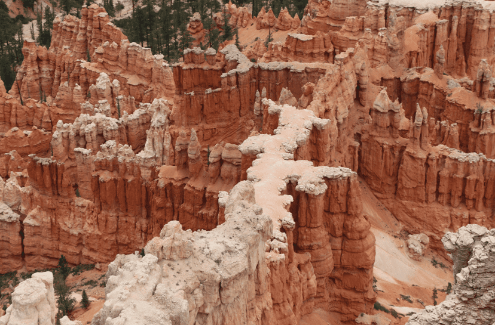
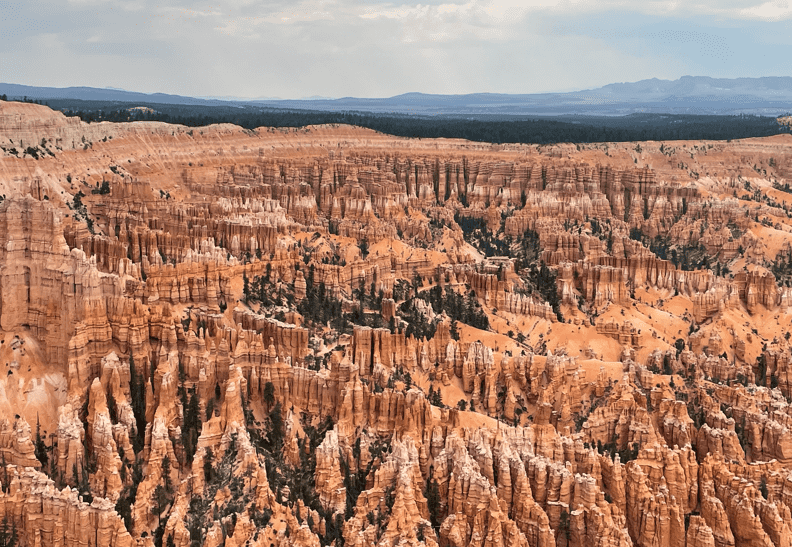

+++
title = "23. Juli"
date = "2024-07-23"
draft = false
pinned = false
tags = ["BryceCanyon"]
image = "screenshot-2024-07-25-032530.png"
description = "Bryce Canyon"
+++
Heute fuhren wir von Salt Lake City zum Bryce Canyon. Wir parkten unsern Camper auf dem Campingplatz und nahmen den Busshuttle zur Kante. Das Bryce Canyon ist eigentlich kein echtes Canyon wie das Grand Canyon, sondern es war einmal ein See und die Steine sind Sedimente, welche sich abgesetzt haben. Durch die Erosion sind nun die berühmten Türme entstanden.

