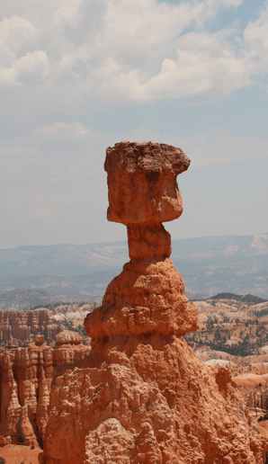
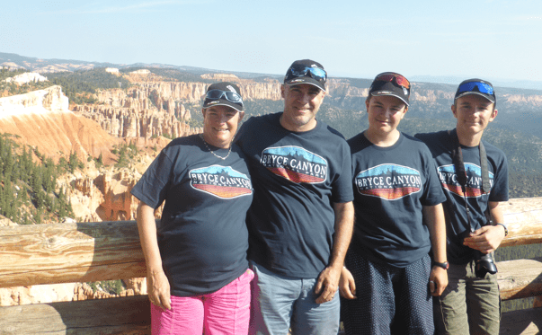
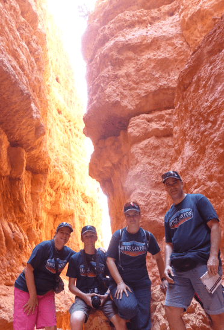

+++
title = "24. Juli"
date = "2024-07-24"
draft = false
pinned = false
tags = ["BryceCanyon"]
image = "screenshot-2024-07-25-194606.png"
description = "Bryce Canyon"
+++
Heute gingen wir zuerst auf den Rundweg mit dem Camper, welcher sehr viele Aussichtspunkte hatte. Wir sahen die verschiedenste Winkel des Bryce Canyons. Vor dem Mittag gingen wir noch den Navajo-Loop wandern. Annelis machte ihn nun zum 3. Mal. Der Loop war ein Rundweg unterhalb der Kante des Canyons. Wir liefen durch die Steinformationen. Nick machte sehr fleissig Bilder. Danach assen wir zu Mittag und fuhren los in Richtung Zion National Park. Eigentlich wäre das eine knapp 1,5 h Fahrt, doch als wir beim Eingang angekommen waren, um durch den Park zu fahren zu unserem Campingplatz, sagten sie uns, dass wir zu hoch seinen und nicht durch den Tunnel fahren können. Also mussten wir rundherum fahren, das waren weitere 2h Fahrt. Wir sind aber gut angekommen und haben ein leckeres Abendessen genossen.

