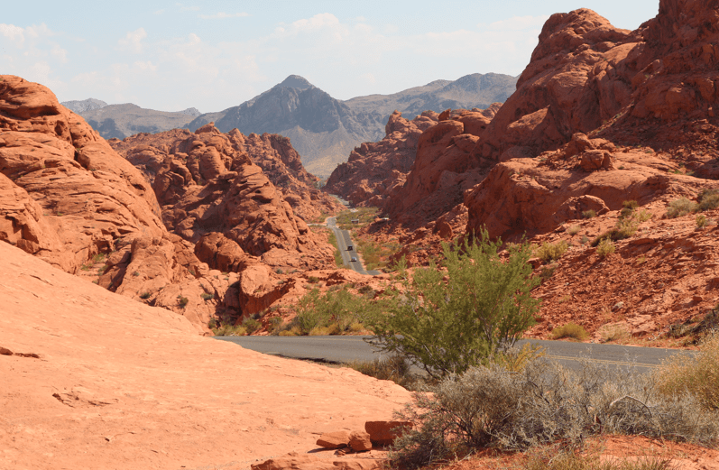
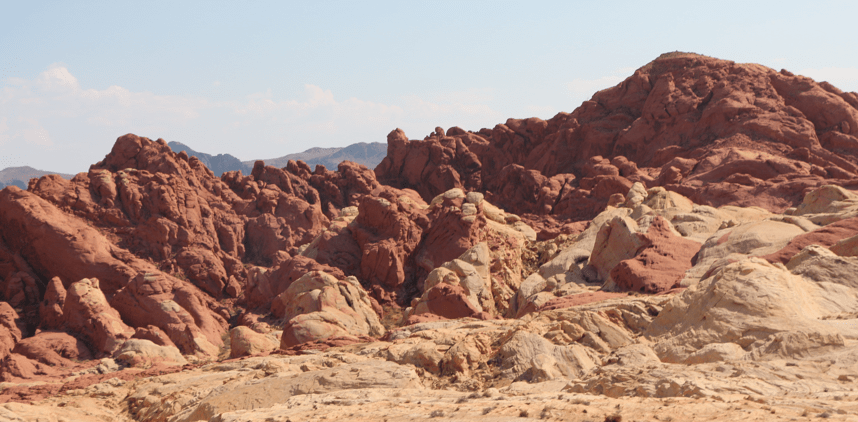

+++
title = "25.7"
date = "2024-07-25"
draft = true
pinned = false
tags = ["Zion", "ValleofFire"]
image = "screenshot-2024-07-26-030916.png"
description = "Zion, Valley of Fire"
+++
Heute Morgen gingen wir in den Zion National Park. Wir bestiegen den Shuttle und fuhren nach hinten in den Canyon. Dort wanderten wir ein bisschen bis zu dem Bereich, wo man mit den Schuhen im Wasser des Canyons weiterwaten konnte. Wir fanden auch die schöne Blume, welche Annelis schon vor 30 Jahren gesehen hatte.

Nach der Wanderung fuhren wir mit dem Camper zum Valley of Fire. Dort angekommen, hatten wir ein Problem beim Eintrittsticket, denn wir konnten es nicht lösen. Als wir ausgestiegen sind, bemerkten wir die unfassbare Hitze. Wir fuhren zum Visitor Center und behoben das Problem. Danach fuhren wir durch den Park und fotografierten die Natur vom Camper aus, denn sonst war es einfach zu heiss. Am Abend fuhren wir zum Campingplatz und assen gemütlich unser Abendessen (selbst gemachte Hamburger).

Zion: 

Valley of Fire: 

