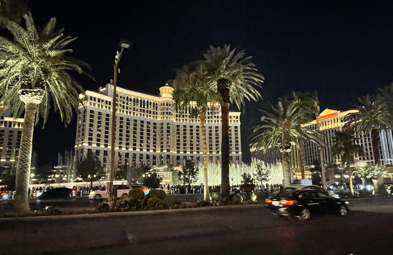

+++
title = "26. Juli"
date = "2024-07-26"
draft = false
pinned = false
tags = ["LasVegas"]
image = "screenshot-2024-07-27-200724.png"
description = "Shoppen in Las Vegas, Las Vegas in der Nacht"
+++
Heute fuhren wir nach Las Vegas. Schon ausserhalb sahen wir den Wahnsinn der Stadt. Wir gingen den ganzen Tag shoppen und fanden sogar einen Skianzug für Anna. Das Outlet-Einkaufszentrum war wie eine kleine Stadt in der Stadt.

Am Abend gingen wir ins Zentrum von Las Vegas. Da wurden wir mit viel zu hellen Lichter, viel zu lauter Musik und viel zu vielen Menschen konfrontiert. Man wusste gar nicht wo hinschauen und aus dem Staunen kam man gar nicht heraus. Der Himmel war nicht dunkelblau, sondern immer so petroltürkis bis hellblau. Es ist krass, wie viel Strom da gebraucht wird. Es hat eine riesige Kugel, die leuchtet immer rundherum und wechselt die Bilder. In der Kugel soll ein Konzertsaal sein. der Stromverbrauch gleicht einer kleinen Stadt hat Nick gegoogelt. Es war unheimlich eindrücklich, doch es machte auch sehr müde. Da es den ganzen Tag so heiss war, hat es natürlich nicht unbedingt besser gemacht. Wir kamen am Ende todmüde zum Camper.

