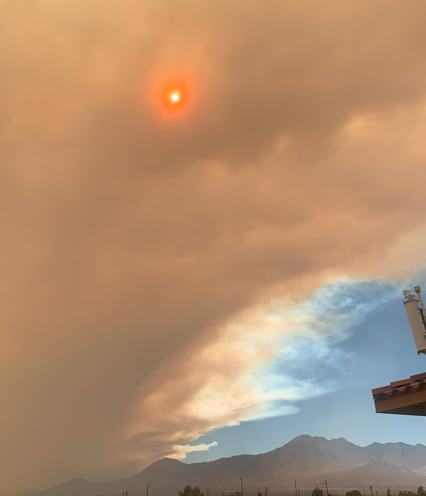
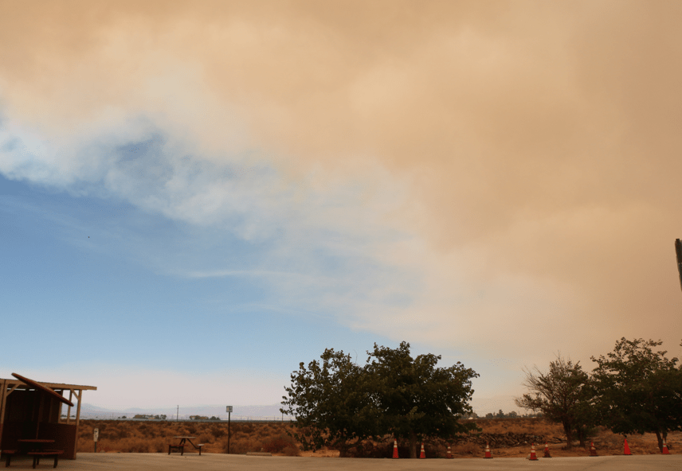
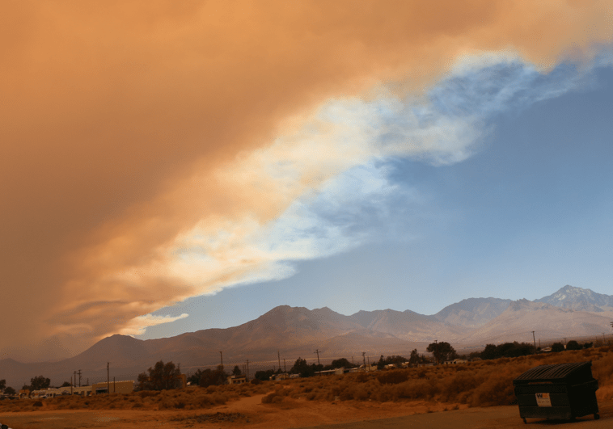

+++
title = "27. Juli"
date = "2024-07-27"
draft = false
pinned = false
tags = ["Bakersfield"]
image = "screenshot-2024-07-28-060659.png"
description = "Fahrt von Las Vegas nach Bakersfield"
+++
Heute ging es gemütlich los und wir wollten zum Lake Isabella fahren. Doch während wir fuhren, fuhren wir durch starken Rauch. Der starke Rauch verdunkelte stark den Himmel und wir hatten eine spezielle Weltuntergangsstimmung. An einer Tankstelle kurz darauf erfuhren wir, dass es am See brennt und in die Region evakuiert wurde. Also mussten wir umplanen. Wir fuhren dann nach Bakersfield auf einen Campingplatz. Am Abend sahen wir das wir vom Lake Isabella gar nicht weitergekommen wären, denn die Strasse weg vom See, ist wegen den Bränden geschlossen.

