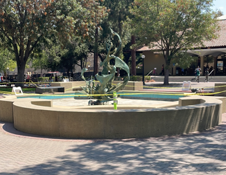
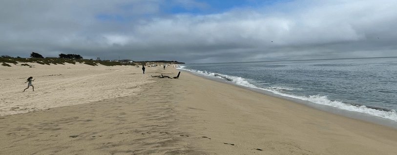
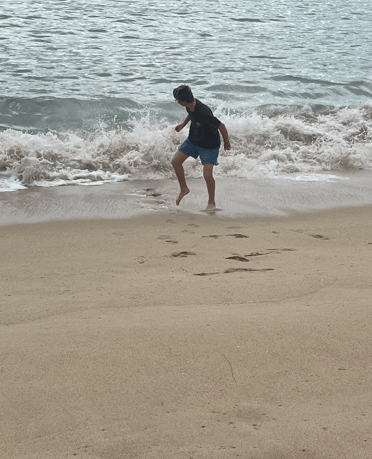

+++
title = "29. Juli"
date = "2024-07-29"
draft = false
pinned = false
tags = ["Stanford", "HalfMooonBay"]
image = "screenshot-2024-07-30-054347.png"
description = "Stanford, Half Moon Bay"
+++
Heute gingen wir nach Stanford. Annelis freute sich sehr und fand den Brunnen, in welchem sie vor 43 Jahren gebadet hatte.

Wir fuhren weiter in die Half Moon Bay. Dort sahen wir von weitem ein paar Wale im Pazifik. Dies ist normal für diese Jahreszeit. Wir waren nicht im Meer, denn es hatte zu viel Strömung nach aussen. Am Abend begannen wir zu packen und verschenkten noch ein paar Lebensmittel, denn wir geben morgen schon unseren Camper ab.

