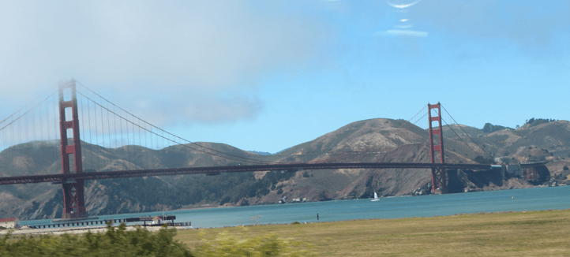
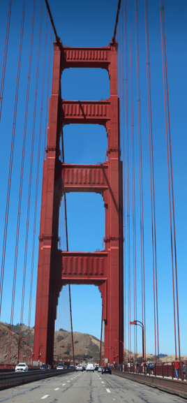
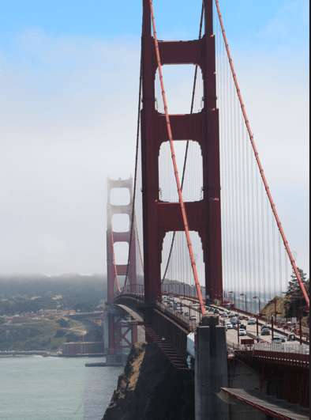
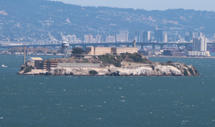
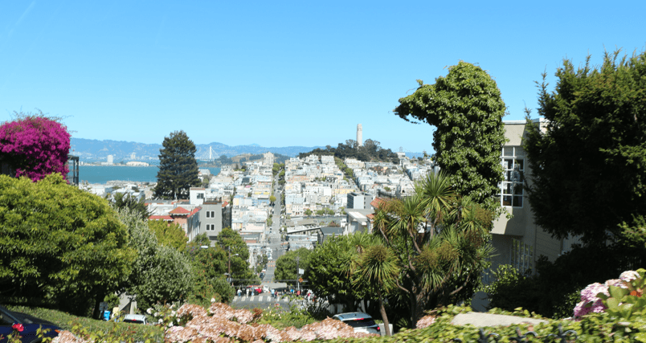
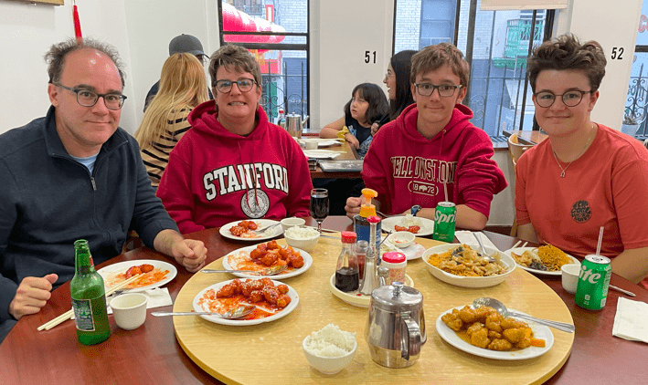

+++
title = "30. Juli"
date = "2024-07-30"
draft = false
pinned = false
tags = ["SanFrancisco"]
image = "screenshot-2024-07-31-063427.png"
description = "Bay Bridge, Golden Gate Bridge, Lombard Street, Cable Car, Chinatown"
+++
Heute Morgen gaben wir unseren Camper zurück und fuhren dann über die Bay Bridge nach San Francisco. Wir stellten unser Auto im Hotel ab und liefen und shoppten ein bisschen durch die Fischermans Wharf. Da sahen wir, dass die Golden Gate Bridge in der Sonne war, deshalb fuhren wir sofort dort hin. Danach ging es weiter zur Lombard Street. Annelis war sehr glücklich, dass sie über beide Brücken und die Lombard Street fahren durfte. Wir stellten das Auto wieder ins Hotel und gingen auf den Cable Car. Dort mussten wir zwar sehr lange anstehen, doch es lohnte sich sehr. Es war mega lustig. Wir fuhren in das Viertel Chinatown und assen dort Abendessen.

