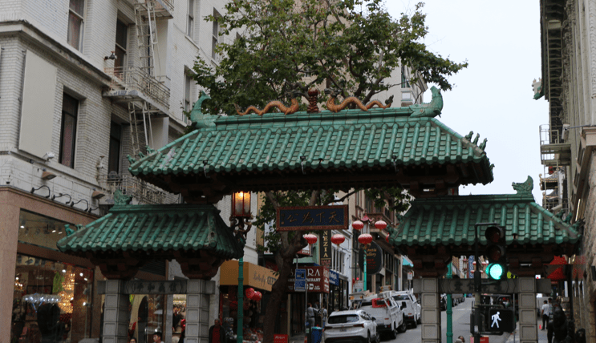
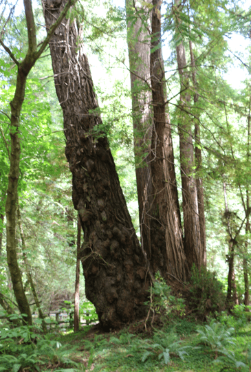
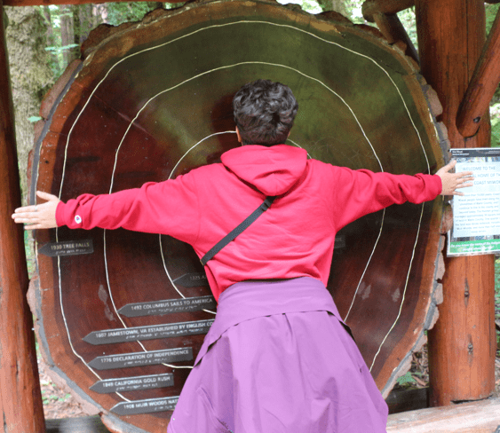
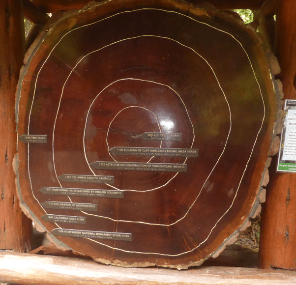
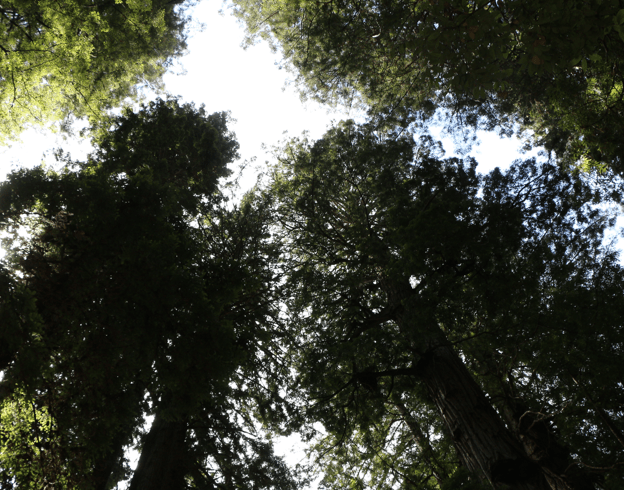
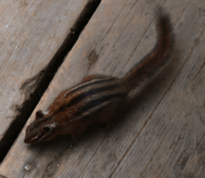
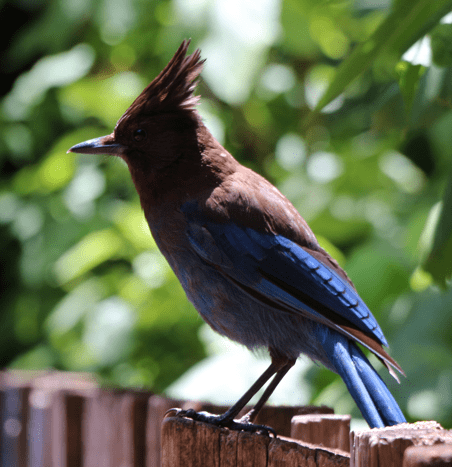
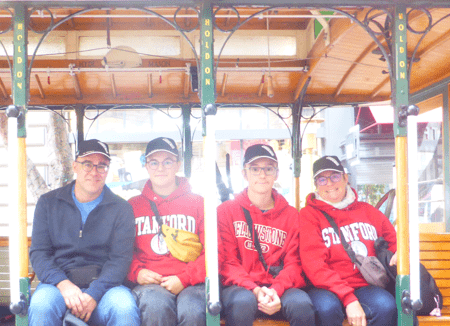

+++
title = "31. Juli"
date = "2024-07-31"
draft = false
pinned = false
tags = ["SanFrancisco"]
image = "screenshot-2024-08-01-070610.png"
description = "Rundfahrt, Muir Woods, Cable Car "
+++
Heute gingen wir los und wollten eigentlich eine Hop-on-Hop-off-Tour machen, doch da fanden wir heraus, dass wir die Audio-Beiträge über eine App hören können und machten die Tour mit unserem Auto. Wir gingen wieder über die Golden Gate Bridge und noch in die Muir Woods. Da gab es grosse und sehr alte Bäume. Es war sehr entspannend. Im Anschluss machten wir unsere Tour weiter und assen dann im Hotel die Resten von gestern Abend. Am Nachmittag fuhren wir einfach mit dem Cable Car. Am Abend gingen wir wieder in die Chinatown essen. Auch hier hat sich seit 43 Jahren nichts verändert. Danach gingen wir mit dem Cable Car nach zurück nach Hause.

