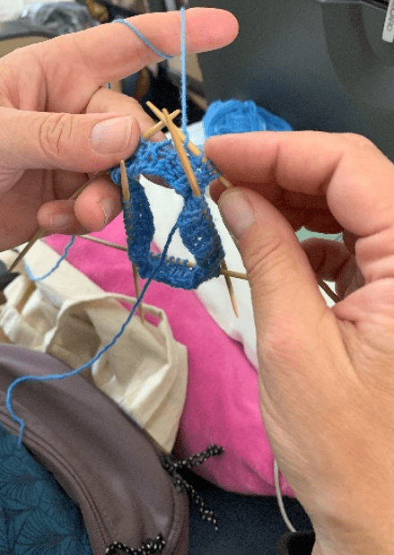
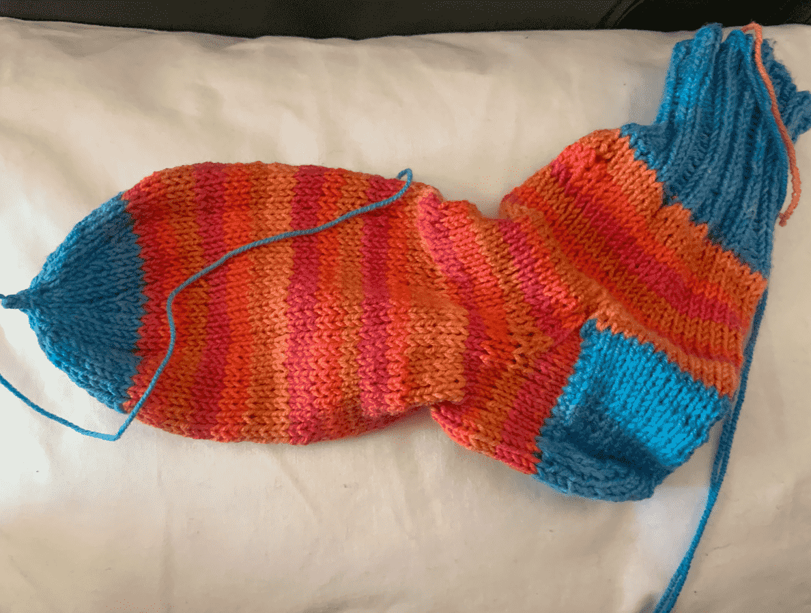
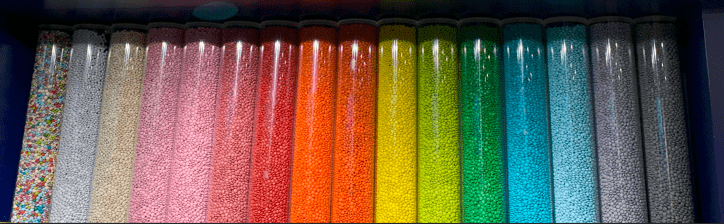

+++
title = "6. Juli"
date = "2024-07-06"
draft = false
pinned = false
tags = ["NewYork"]
image = "p1100363-min-1-.jpg"
description = "Der erste Tag war aufregend und nervenzerreissend, doch auch sehr überwältigend und sehr ungewohnt. "
+++
# 6. Juli

Aufgestanden um 4:00 Uhr um 5:40 Uhr den Bus zu erwischen, dann begann die ganze Reise. Oder vielleicht schon am Abend vorher als der letzte Koffer geschlossen wurde. Auf den Bus, auf den Zug, in Bern einmal umsteigen und dann heiss es schon «Nächster Halt: Zürich Flughafen». Da begann alles. All das, was heute passiert ist, bevor wir überhaupt ins Flugzeug gingen.

Zuerst Check-In. Wie immer eine Riesensache. Anna und Nick hatten einen Elektronischen Bordingpass mit zugeteiltem Sitz. Adi hatte zwar einen Sitzplatz doch keine Boardingkarte und Annelis hatte nichts. Guter Start, aber man kann darauf aufbauen. Also holten Anna und Nick ihre Kleber für an den Koffer. Also suchten wir einen Schalter, um die Probleme zu beheben. Adi bekam eine Bordkarte, doch Annelis hatte immer noch nichts. Angeblich braucht sie ein neues Visa, dass heisst die Chance das sie es auf den Flieger schafft flog weg. Also werden die Koffer etwas umgepackt das Anna, Nick und Adi alles Wichtige haben, denn es wurde nicht so gepackt das jeder sein Koffer hatte, sondern das in jedem Koffer von jedem Sachen sind, damit selbst wenn ein Koffer nicht ankommt wir noch Kleider haben. Natürlich war nicht Annelis Necessaire im Koffer von Annelis, sondern das von Nick also musste dies auch noch getauscht werden. Dann heisst es die drei Koffer aufgegeben und nach einer Lösung für Annelis suchen. Also rannten wir durch den halben Flughafen. Am Schalter musste man natürlich warten, da hat Adi selber versucht das Problem zu lösen. Und Tada: Erfolg. Annelis konnte doch noch einchecken. Also ging es wieder zum Schalter, um eine Bordkarte zu bekommen und auch noch den letzten Koffer auf die Reise zu schicken.

Dann ging es auf zur Sicherheitskontrolle. Der nächste Meilenstein. Die Vorstellung davon ist eher: Anstehen, anstehen, anstehen. Was mit der jetzigen Verspätung fatal gewesen wäre. Doch wir kam so geschmeidig durch die Kontrolle wie noch nie. Nur Anna wurde noch geflitzt; «Zufallskontrolle». Dann hiess es nur noch Wasser kaufen und das Gate finden. Wasser kaufen; das war auch so eine Sache, denn die nächste Kasse war natürlich defekt. Dennoch gab es Wasser und dann gings auf zum Gate. Natürlich bei unserem Glück flogen wir von Gate E. Wer den Flughafen Zürich kennt, weiss das dies das Gate etwas ausserhalb ist. Also, runter die Treppe, durch die Passkontrolle (ohne Probleme, zum Glück) und auf den Shuttle warten. Nach 2 Minuten war dies Zum glück da. Wieder ausgestiegen hiesse es nur noch nach hinten gehen, denn wir hatten nicht Gate E48, sondern E26 (war ja zu erwarten), aber hätte schlimmer kommen können. Hinten gingen Annelis und Anna mal aus WC und Nick und Adi warteten. Da erfuhren sie das sie noch einen Stempel brauchten. Adi und Nick gingen den holen und Adi wurde auch noch geflitzt. In Zwischenzeit kamen Annelis und Anna aus der Toilette und standen mal an. Da kam Nick und erzählte vom Stempel. Also stand jetzt Nick an und die Frauen gingen den Stempel holen. Adi kam zurück und bald begann das Boarding. Im Flieger angekommen wurden die Plätze eingenommen und der Flug konnte beginnen. Annelis nahm sofort ihr Lismete hervor und begann zu stricken. 

Zum Zmittag gab es Knöpfli mit Poulet und Broccoli. Daneben gab es noch einen Kleine Salat eine Caramel-Creme und am Nachmittag (jedenfalls in Schweizer Zeit) gab es noch Gemüsekuchen und ein Schokoeis. Während dem Flug wurden fleissig Filme geschaut und Musik gehört.

Kaum gelandet, wurde auch schon für die Passkontrolle angestanden. Adi und Nick kamen mit Leichtigkeit durch. Anna hatte ein Problem mit ihren Fingerabdrücken und Annelis wieder mit dem Visum. Also mussten die Frauen noch etwas warten. Annas Problem war schnell gelöst. Auch Annelis kam bald wieder davon. Das Problem bei der ganzen Sache war die ganze Zeit das ein O anstatt eine Null im Visa eingetragen wurde. Die Dame bei der Passkontrolle hat dies dann schnell geändert und schon konnten wir endlich den Flughafen verlassen und ein Taxi in Richtung Hotel nehmen. Da wurde dann zum ersten Mal ein Blick auf die Skyline geworfen.

Kaum in Hotel angekommen haben wir es auch schon wieder verlassen, um zu erkunden. Das Hotel liegt in der Nähe des Time Square. Das muss natürlich besichtigt werden. Der Anblick der endlosen LED-Tafeln war schlichtweg überwältigend. Wir standen einfach auf dem Platz und haben es auf uns wirken lassen. Weiter ging es auf die 6th Avenue. Dort konnte man auf der Strasse laufen und eine Art Mart besuchen. Dort assen wir noch Fleischspiesse und Empanadas und als Nachspeise gab es Früchte, denn diese waren massiv zu kurz gekommen. Es wurde weiter flaniert und ein paar Geschäfte besucht. Unter anderen der M&M’s-Laden. Dort fanden wir M&M’s in allen Farben. Als letzte Aktion des Tages wurde noch Wasser gekauft den die Hitze und die vielen Leute mache durstig.

Wir wünschen eine Gute Nacht, respektive einen Guten Morgen.