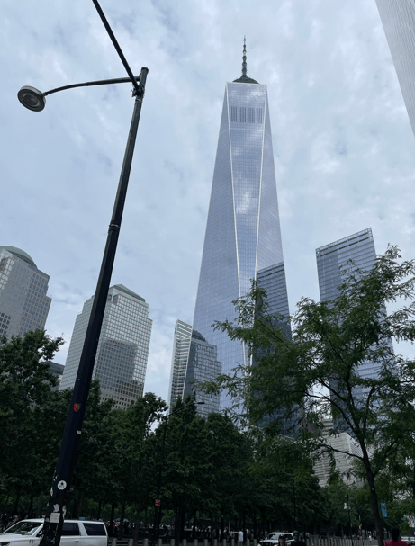
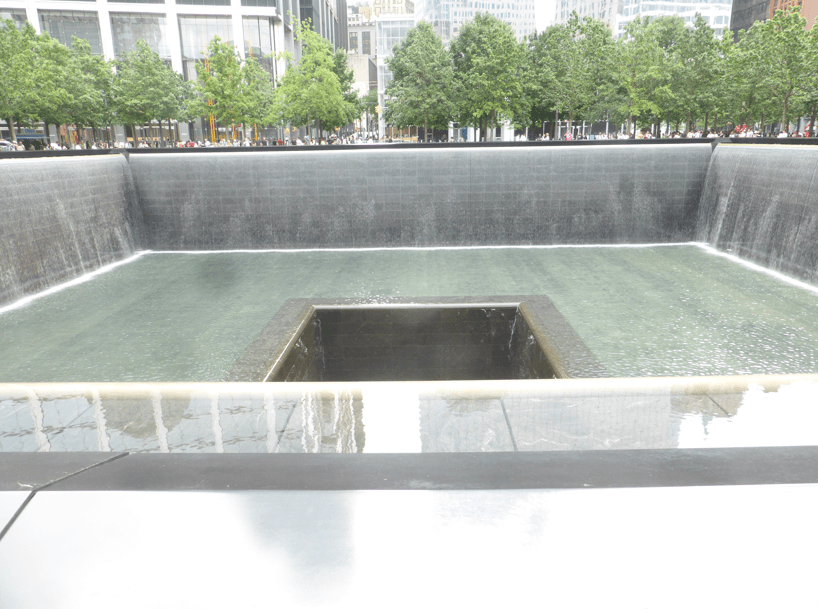
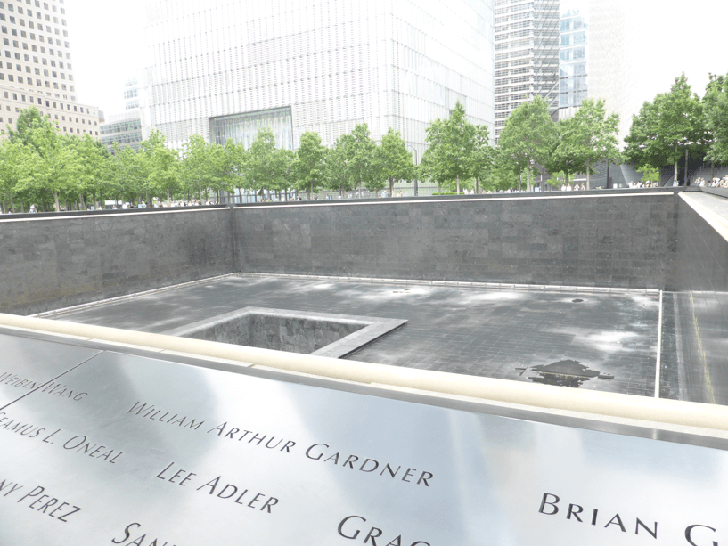
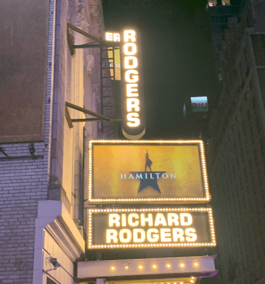
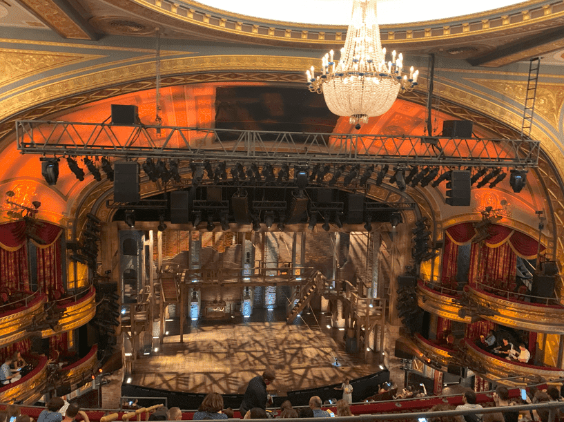
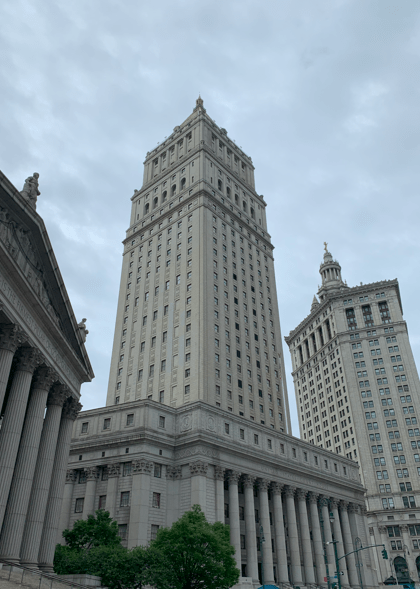
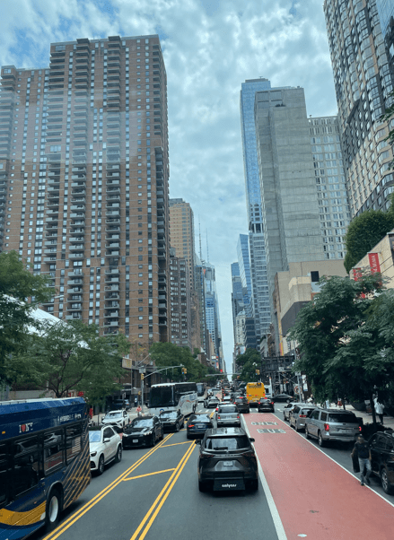
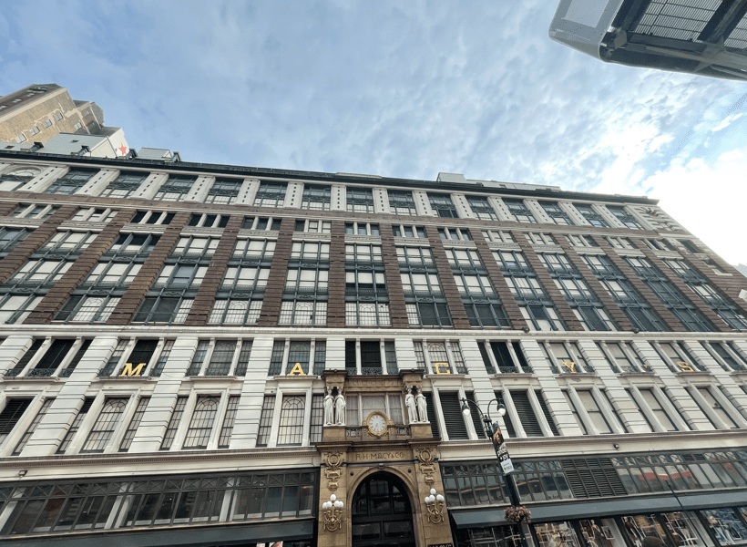
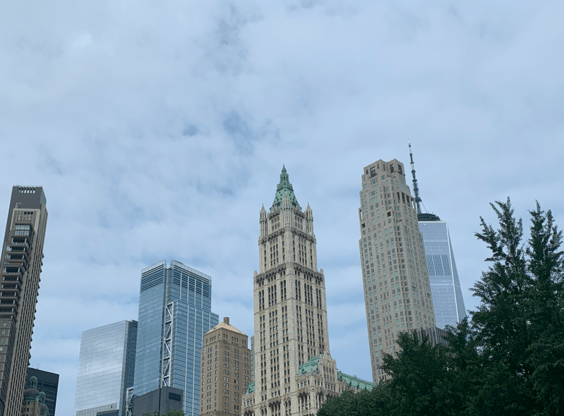
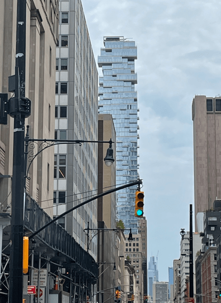

+++
title = "7. Juli"
date = "2024-07-07"
draft = true
pinned = false
tags = ["NewYork"]
image = "screenshot-2024-07-09-031056.png"
description = "Ground Zero, Stadtrundfahrt und Hamilton, das Musical"
+++
Die Nacht überstanden, ging es auf die Suche nach einer Bäckerei fürs Frühstück. Danach ging es ab zu einem Stopp eines Hop-on-Hop-off-Busses. Kaum losgefahren, sahen wir das Flatiron-Gebäude. Leider hatte es ein Gerüst darum. 

Weiter ging die Fahrt bis zum Stopp für den Ground Zero. Da hatten wir ein Tour gebucht. Los ging es neben der St. Paul's Chapel. Sie ist das einzige Gebäude in nächster Nähe, welche beim Einsturz der Türme keinen Schaden genommen hatte. Die Führung führte uns durch die Gebäude, welche auf dem Gebiet des ehemaligen 7 Gebäude grossen World Trade Komplexes erbaut wurden. Wir sahen auch den neuen World-Trade-Center, welcher genau 1776 Fuss hoch ist. Dieser ist extra so hoch, weil im Jahr 1776 die USA unabhängig wurde,

Die Führung endete bei Ground Zero, dem Denkmal an die Verstorbenen von 9/11. 

Die Denkmäler sind jeweils dem Grundriss des ehemaligen Gebäudes nachgebaut und darauf die Namen der Verstorbenen verewigt. In der Mitte hat es einen Brunnen. 

Danach ging unsere Stadtrundfahrt weiter. Wir fuhren um den Central Parkt und wieder runter zu Süd-Seite der Insel.

Am Abend gingen wir dann ins Musical. Hamilton stand auf dem Programm. 

Im Musical ging es um Alexander Hamilton, einer der Gründungsväter der USA. Es war eine energiegeladene Aufführung im modernen Style mit viel Rap.

Noch ein paar Eindrücke von der Stadtrundfahrt: 

