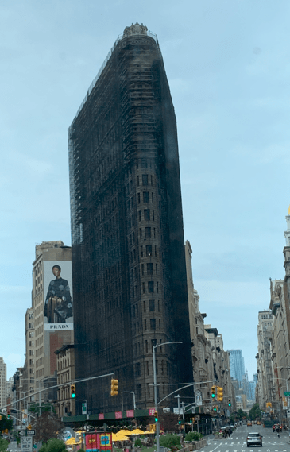

+++
title = "7. Juli"
date = "2024-07-07"
draft = true
pinned = false
tags = ["NewYork"]
image = "screenshot-2024-07-08-045816-1-1-.png"
+++
Die Nacht überstanden, ging es auf die Suche nach einer Bäckerei fürs Frühstück. Danach ging es ab zu einem Stop eines Hop-on-Hop-off-Busses. Kaum losgefahren, sahen wir das Flatiron-Gebäude. Leider hatte es ein Gerüst darum. 

Weiter ging die Fahrt bis zum Stopp, für den Ground Zero. Da hatten wir ein Tour gebucht. Los ging es neben der St. Paul's Chapel. Sie ist das einzige Gebäude in nächster Nähe, welche beim Einsturz der Türme keine Schaden genommen hatte.

* Ground zero
* rundfahrt
* hamilton