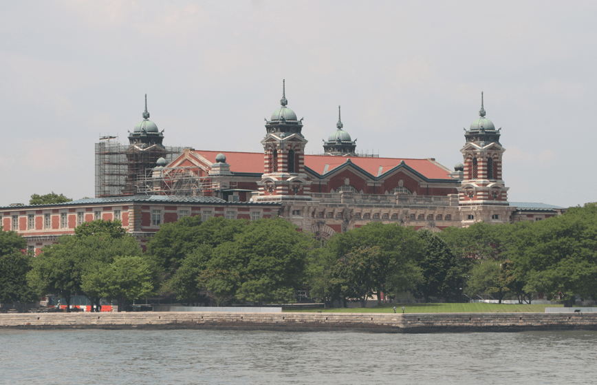

+++
title = "8. Juli "
date = "2024-07-08"
draft = false
pinned = false
tags = ["NewYork"]
image = "screenshot-2024-07-09-032541.png"
description = "Chinatown, Flussrundfahrt, One World Trade Center und SUMMIT-Gebäude "
+++
Heute sind wir wieder zeitig aufgestanden und haben uns was zu Frühstück gesucht. Danach nahmen wir die U-Bahn bis ins Quartier Chinatown. Dort ist die Zeit in den letzten Jahren einfach stehen geblieben. Laut Annelis hat sich da nichts verändert, seit sie vor 30 Jahren dort war. Nach Besichtigung Chinatown haben wir eine Flussrundfahrt gemacht. Die Fahrt ging nach Ellis Island, zur Freiheitsstatue und unter der Manhattan- und der Brooklyn Bridge durch. Wir hatten einen wunderbaren Ausblick auf die Statue. Nick konnte mit seiner super Kamera sogar so weit hinein zoomen, dass er den Text lesen konnte auf dem Buch im Arm der Statue.

Vom Wasser aus hatte man auch eine super Blick auf die Skyline und die verschieden Wolkenkratzer.

Danach ging es weiter in Richtung der grossen Brücken.

Nach der Flussfahrt beschloss Annelis, dass sie noch auf den neuen World Trade Center will. Vor 30 Jahren war sie auf dem Alten, deshalb möchte sie jetzt auf den Neuen. Also holten wir uns Tickets und wurden mit dem Lift nach oben katapultiert. Die Aussicht dort oben war atemberaubend. Man konnte einmal um das ganze Gebäude herumlaufen, so hatte man einen 360° Ausblick. Leider war es etwas dunstig, deshalb sahen wir nicht so viel vom Festland. Von oben sieht man New York nochmal mit ganz anderen Augen.

Schon wieder unten nahmen wir wieder die U-Bahn und gingen zum SUMMIT-Gebäude, um dort ebenfalls die Aussicht von einem andere Punkt in der Stadt zu geniessen. Die Aussicht war ganz anders, denn man sah auch noch den Central Park. Man merkte auch, dass es hinter dem Central Park keine Wolkenkratzen mehr gibt und es ein bisschen heruntergekommener ist.

Wieder unten gingen wir noch ein letztes Mal zum Time Square und sogen die Stimmung auf. Auf den Nachhauseweg konnten wir durch die Häuserschluchten noch den Sonnenuntergang sehen.

