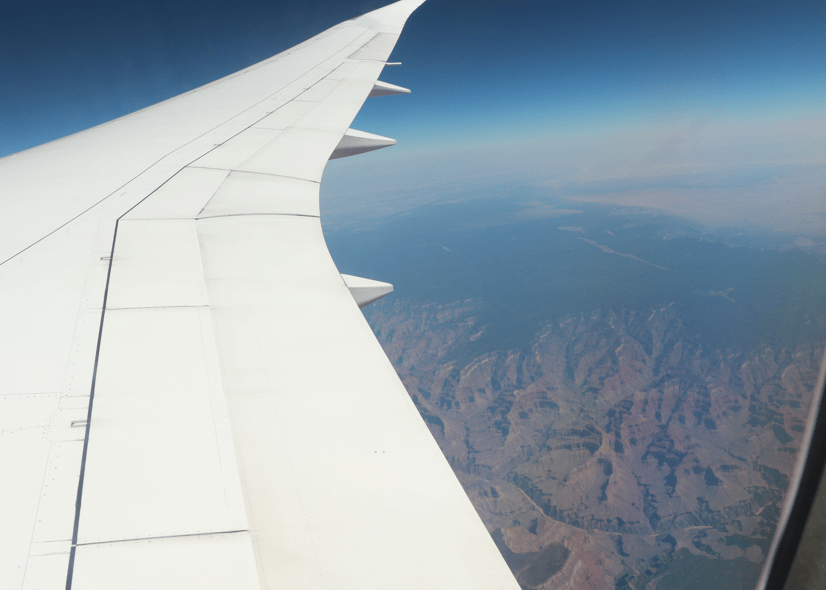

+++
title = "9. Juli"
date = "2024-07-09"
draft = false
pinned = false
tags = ["LosAngeles"]
image = "screenshot-2024-07-10-064149.png"
description = "Flug nach Los Angeles, Walk of Fame und Santa Monica"
+++
Heute ging es früh los zum Flughafen um nach Los Angeles zu fliegen. Auf dem Flug sahen wir sehr viel Landschaft. 

In Los Angeles angekommen, gingen wir zum Hotel und dann an den Walk of Fame, die Strasse mit den Sternen. Wir fanden die Sterne von verschiedensten Musikern und Schauspielern. 

Danach machten wir uns auf den Weg zum Meer. Wir wollten unbedingt an den Strand und ins Wasser. Also gingen wir nach Santa Monica Beach zur Pier 47. Annelis, Anna und Nick gingen ins Meer. Zum Abendessen gab es Fish & Chips. 

